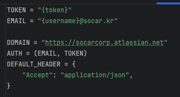

# Notion Exported Html to Confluence

해당 코드는 Notion에서 export한 html을 confluence 특정 폴더로 업로드하는 코드 입니다.

`api/config.py` 에서 TOKEN 과 EMAIL 을 수정한다.

- TOKEN 발급 방법
    - [https://id.atlassian.com/manage-profile/security/api-tokens](https://id.atlassian.com/manage-profile/security/api-tokens)
    - 위 URL 에서 Create API Token(without scopes) 통해서 토큰 발급
- `main.py` 수정
    - `space_name`, `target_page_for_folder`, `new_folder_title`, `html_path` 수정
    - html_path의 경우 아래와 같은 구조여야함
    
    
    
    - 필요하다면 `file_name_postfix` 수정, 업로드 되는 모든 파일에 postfix가 붙음(defualt = “”)
    - `target_page_for_folder`
        - api 상에서 api 테스트-2(creaated by api)와 같은 빈 폴더는 조회가 안됨으로, 베넷 폴더를 조회 하기 위해서 api 테스트-1 과 같은 임시 파일을 생성하여 부모 폴더를 찾아 갈 수 있도록 진행
        - api 테스트-1은 jira confluence 웹에서 생성
        
        